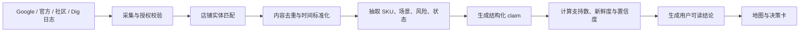
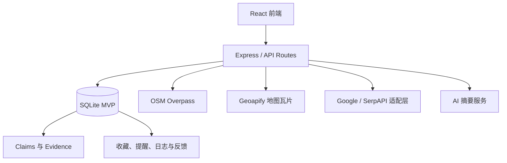

# Dig 港岛旅行店铺探索 MVP PRD

> 版本：v1.0  
> 状态：可进入产品与技术评审  
> 更新日期：2026-08-09  
> 产品范围：香港港岛  
> 界面语言：繁体中文（香港）  
> 文档语言：简体中文

## 1. 产品摘要

Dig 是一款面向海外旅行场景的 AI 店铺决策地图。

它不试图成为另一张“收录更多店铺的地图”，而是将 Google 店铺信息、内容社区讨论、Dig 用户到店日志和官方信息组织成可核验的证据层，直接回答用户在当前位置附近最关心的四个问题：

1. 哪几家现在值得去？
2. 第一次去应该买什么或点什么？
3. 为什么这样推荐？
4. 排队、售罄、闭店、预约和价格方面需要注意什么？

MVP 聚焦香港港岛，目标是在 60 秒内帮助旅行中的用户从“附近店很多”走到“我决定去这一家”。

## 2. 背景与用户问题

### 2.1 现有探索流程的问题

海外旅行时，用户往往需要在多个产品之间反复切换：

- 在传统地图中找附近店铺、营业时间和路线。
- 在内容社区中逐篇阅读帖子与评论，判断店铺是否值得去。
- 再回到地图里收藏或标记地点。
- 临出发前重新确认店铺是否闭店、临时休息、需要预约或热门商品是否售罄。

这个过程存在四类高成本：

| 问题 | 当前表现 | 用户成本 |
| --- | --- | --- |
| 评价粒度过粗 | 只有星级、评论数和店名 | 不知道具体买什么、为什么值得去 |
| 内容分散 | 需要逐篇浏览社区帖子和评论 | 决策时间长，容易被单篇内容误导 |
| 收藏与地图割裂 | 内容平台的收藏无法在地图中形成可靠提醒 | 收藏后遗忘，到附近也想不起来 |
| 状态更新不及时 | 营业时间、临时闭店、排队与售罄信息分散 | 到店扑空或付出额外时间成本 |

### 2.2 核心产品机会

Dig 的机会不是“聚合更多评价”，而是建立一套基于来源、时间和置信度的店铺决策系统：

- 用地图解决“我现在在哪里、附近有什么、怎么去”。
- 用 AI 证据层解决“为什么值得去、买什么、有哪些风险”。
- 用收藏与位置提醒解决“我曾经想去，但旅行时忘了”。
- 用 Dig 到店日志解决“真实用户去过之后怎么评价”。

## 3. 产品目标

### 3.1 MVP 目标

- 在港岛范围内提供稳定、可浏览的附近 POI 地图。
- 首屏只突出 3–5 个当前最值得用户关注的店铺。
- 在首次点击详情前，就展示店铺、代表性商品、AI 一句话判断和证据量；风险与完整解释在一次半屏展开中完成。
- 将 Google、内容社区、官方信息和 Dig 日志组织成可追溯的结构化结论。
- 支持收藏、附近提醒、到店记录和用户反馈。
- 通过演示数据完整呈现产品价值，而不是依赖实时大规模抓取才能运行。

### 3.2 非目标

MVP 不做以下能力：

- 不覆盖整个香港、其他城市或全球范围。
- 不做完整旅行行程规划、酒店、机票或交通票务。
- 不追求收录所有店铺；基础 POI 可以很多，但有结论的店铺必须有证据。
- 不把单一星级或评论数直接转换成“神店”“必去”等营销标签。
- 不在每次打开地图时同步调用 Google 或 AI 接口。
- 不上线依赖未经授权抓取的内容数据管线。
- 不单独设计“SKU 全屏证据页”；证据应在半屏店铺决策卡内完成解释。

## 4. 目标用户与核心场景

### 4.1 目标用户

主要用户：正在香港自由行、愿意探索本地餐饮和特色店铺、习惯参考内容社区做决策的中文用户。

典型特征：

- 每天有大量步行探索场景。
- 关注具体商品和体验，而不只关注店铺评分。
- 会在小红书、Google Maps、Reddit 或朋友分享中提前收藏地点。
- 对排队、售罄、临时闭店和支付方式比较敏感。
- 希望快速做决定，不想在街头阅读十几篇长内容。

### 4.2 Jobs to Be Done

| 场景 | 用户任务 |
| --- | --- |
| 到达一个陌生街区 | 告诉我步行范围内最值得去的 3 家店 |
| 决定是否去某店 | 告诉我第一次该买什么、为什么值得去、有什么风险 |
| 临时改变计划 | 告诉我哪些店现在营业、是否需要预约或可能售罄 |
| 经过已收藏店铺 | 提醒我曾经想去，并说明现在是否适合前往 |
| 到店之后 | 快速记录体验，为自己的偏好和其他用户提供反馈 |

## 5. 产品原则

### 5.1 决策优先，而不是店铺数量优先

地图上不应同时让几十家店争夺注意力。漫游页只发布有决策证据的候选 POI，并按缩放层级控制其数量和表达强度；基础 POI 不参与推荐地图的注意力竞争。

### 5.2 先有证据，再有结论

AI 不先写营销文案。系统必须先形成结构化 claim、证据数量、来源、更新时间和置信度，再生成面向用户的总结。

### 5.3 不确定性必须可见

证据不足时不进入漫游页推荐层；在搜索结果或店铺基础页中明确显示“资料不足”，不生成“隐藏神店”“高分咖啡”等没有决策价值的标签。

### 5.4 地图负责空间，卡片负责判断

地图标记只呈现用户此刻需要的最小信息；买什么、为什么、风险和来源放在底部决策卡中。

### 5.5 手绘感只能作为强调

手绘感用于收藏环、强推荐状态、空状态和少量强调图标。底图、道路文字和密集 POI 保持干净，避免与地图可读性竞争。

## 6. MVP 范围

### 6.1 地理范围

覆盖香港港岛主要旅行街区：

- 西营盘
- 上环
- 中环
- 湾仔
- 铜锣湾
- 坚尼地城

用户可以使用当前位置，也可以手动切换街区。手动选择街区后，GPS 更新不能强制把地图拉回当前位置。

### 6.2 店铺范围

MVP 优先覆盖：

- 咖啡
- 烘焙与甜品
- 餐厅
- 酒吧
- 适合作为伴手礼或外带的店铺
- 少量具有旅行体验价值的地点

数据分为两级：

| 等级 | 含义 | 地图表现 |
| --- | --- | --- |
| `decision` | 有结构化结论与来源支持 | 可进入 Top 推荐、显示理由和决策卡 |
| `basic` | 只有基础位置或营业资料 | 不进入漫游推荐层；搜索时可返回基础资料，不生成推荐文案 |

Demo 至少保留 9 家完整证据店铺。OSM 基础 POI 可用于搜索和数据补全，但不以大量灰点填充漫游地图。

## 7. 信息架构

底部主导航包含三个一级入口：

1. 漫游：基于地图和当前位置做附近决策。
2. 搜索：通过自然语言、店名、商品或场景查找店铺。
3. 日志：记录到店反馈、查看个人偏好与历史收藏。

设置作为日志页中的二级入口，不占用主导航。

## 8. 漫游页需求

### 8.1 首屏结构

首屏从上到下分为四层：

1. 顶部品牌、收藏入口和街区选择。
2. 场景条件，而不是传统品类筛选。
3. 地图与分级 POI。
4. 横向决策卡片。

首批场景条件：

- 为你挑
- 15 分钟内
- 想吃甜的
- 能带走

后续可扩展：

- 现在营业
- 适合买伴手礼
- 不排队
- 雨天适合
- 一个人也方便

### 8.2 地图缩放层级

| 地图尺度 | 推荐显示 | 交互目标 |
| --- | --- | --- |
| 城市/城区 | 不显示 Dig POI、区域汇总或推荐气泡，只保留底图 | 先建立城市方位，不用产品信息抢占视线 |
| 街区 | 最多显示 8 个经过排序的推荐 POI；Top 3 为主标记，第 4–8 名为小点 | 既让用户感知附近选择，又避免“全部显示”造成拥挤 |
| 街道 | 最多显示 10 个排序候选；Top 5 可显示店名和步行时间，其余保留小点 | 支持步行级比较，碰撞时优先保证 Top 结果 |
| 选中店铺 | 标记出现选中环并打开半屏店铺详情；地图镜头不自动移动 | 让用户保持空间上下文，不因查看信息失去方位 |

地图基础规则：

- 只有具备 `decision` 级证据或明确收藏状态的店铺才进入漫游候选池。
- Top 3 推荐使用品牌蓝绿色核心点和小型星芒。
- 第 4–8 名在街区尺度使用小型品牌色点，不显示文字。
- 收藏店使用独立金色书签环，不只是更换品类颜色。
- 营业、排队、预约或售罄风险使用橙色状态点。
- 证据不足的店铺不显示“值得去”文案。
- 标记标签发生碰撞时，保留高优先级标记，低优先级仅保留点。
- 地图底图不做额外亮度蒙层，不允许通过压暗地图解决标签可读性。

### 8.3 当前赢家

地图每次选择 3–5 家“当前赢家”，并保留少量次级推荐点作为附近选择的空间参照。候选店必须满足：

- 有 `decision` 级证据，或是用户已收藏店铺。
- 与当前场景条件匹配。
- 在当前可探索范围内具有合理可达性。

赢家排序使用以下信号：

```text
当前可达性
+ 营业可信度
+ 用户偏好匹配
+ 证据强度
+ 内容新鲜度
+ 收藏状态
- 到店风险
- 数据不确定性
```

建议首版权重：

| 信号 | 权重建议 |
| --- | ---: |
| 当前可达性 | 25% |
| 营业可信度 | 15% |
| 用户偏好匹配 | 20% |
| 证据强度 | 20% |
| 内容新鲜度 | 10% |
| 收藏状态 | 10% |
| 风险与不确定性 | 负向扣分 |

权重需要通过真实行为数据校准，不能长期作为硬编码真理。

### 8.4 紧凑店铺比较卡

地图底部始终展示 3–5 张可左右滑动的店铺卡片。横滑只是比较附近候选，不改变地图中心、不切换地图选中态，也不触发任何数据刷新。用户点击整张卡片后，打开对应店铺的半屏详情。

首层卡片必须直接包含：

- 店面门头或最具识别度的照片。
- 店名和步行时间。
- 一句 AI 综合判断作为视觉主信息。
- 店铺品类和一个代表性 SKU，帮助用户快速建立预期。
- 近期内容数量；没有证据时显示“资料不足”。
- 轻量进入箭头；整张卡片为点击区域，不设置“看看这款”等嵌套按钮。

卡片高度控制在 `96–100px`，宽度控制在 `286–296px`，避免遮挡过多地图。卡片不承担完整风险解释，只用于横向比较；风险和到店条件进入半屏详情。

推荐示例：

```text
Bakehouse Soho · 14 分钟
烘焙店 · 酸种蛋挞
出品稳定，适合顺路买走；午后热门品项较易售罄
18 条近期内容  ›
```

禁止使用以下低信息量文案作为核心结论：

- 必买
- 主打 Chinese
- 高分咖啡
- 隐藏神店
- 网红打卡
- 值得一试

### 8.5 单一半屏店铺决策详情

用户点击横向卡片或地图标记后，直接打开约 `54–58%` 屏高的店铺详情，地图仍保留在上方。产品不再设置 SKU 半屏、完整店铺详情和证据全屏三个重复阶段。

半屏详情内容顺序：

1. 店名、品类、街区、营业状态、付款方式和步行时间。
2. 门头与餐品照片横滑画廊：第一张优先门头，至少一张代表性餐品。
3. “AI 综合判断”：基于该店全部有效 claim、近期外部内容和 Dig 日志生成总体总结，并标注综合内容数量。
4. 招牌商品集合，不突出唯一 SKU。
5. 最佳到店时间、排队、预约、售罄、价格或状态风险。
6. 地址、营业时间、预算和付款方式。
7. Google Maps、小红书和官网的直接跳转链接，不增加“资料来源”标题。
8. 固定底栏主动作“开始步行”，收藏和打卡为图标次动作。

AI 综合判断必须先汇总不同来源中的店铺级结论、招牌、场景、风险和新鲜度，再生成摘要；不得把某个 SKU claim 直接改写成对整家店的总结。证据不足时显示“资料仍在累积”，不生成确定性推荐。

半屏详情不展示“去了怎么选”“去过的人留下了什么”或“资料来源”标题。不单独建设全屏证据页；用户需要核验时直接跳转原始外部链接。

### 8.6 地图移动与刷新

- 拖动地图时不得同步重新抓取、重排标记或自动跳回当前位置。
- 漫游页不提供“搜索此区域”悬浮模块。
- 横滑店铺卡不改变地图中心；点击卡片或地图标记只打开内容，不自动重设镜头。
- 新区域数据通过用户主动切换街区或后续明确的探索入口加载，不在拖图过程中隐式发生。
- 地图请求失败时保留已有数据和底图，不清空当前页面。

### 8.7 位置与街区

- 首次进入尝试读取定位。
- 定位失败时默认西营盘，并明确提示用户当前使用预设位置。
- 用户手动切换街区后，当前会话优先使用手动选择。
- “回到我的位置”只改变地图视角，不隐式清空筛选或收藏状态。

## 9. 搜索页需求

搜索页支持三类输入：

1. 店名：例如“Bakehouse”。
2. 商品或 SKU：例如“蛋挞”“船面”“伴手礼”。
3. 场景：例如“附近现在营业、适合带走的甜点”。

搜索结果排序沿用当前赢家模型，但提高文本匹配和场景匹配权重。

结果卡需展示：

- 店名、街区和步行时间。
- 匹配用户搜索意图的原因。
- 推荐 SKU。
- 最重要风险。
- 证据等级与更新时间。

点击结果后直接进入半屏店铺卡，不打开新的全屏路由。

## 10. 日志与社区反馈

### 10.1 到店日志

用户到店后可以快速记录：

- 还会再去。
- 有点后悔。
- 和预期一致。
- 没有特别惊喜。
- 实际点了什么。
- 文本感受。
- 可选照片。

### 10.2 Dig 反馈的产品价值

Dig 日志同时服务三个目标：

- 帮用户形成自己的旅行与口味记忆。
- 形成第一方、可验证到店的内容来源。
- 校准外部来源和 AI 结论是否与真实体验一致。

半屏详情中，Dig 已验证到店内容优先于外部社区摘要显示。

### 10.3 个人偏好

后续可根据日志形成偏好维度：

- 常去品类。
- 喜欢的氛围。
- 常点 SKU。
- 价格倾向。
- 最常探索街区。
- 后悔率和复访倾向。

MVP 可以先使用规则统计，不要求训练个人模型。

## 11. 收藏与附近提醒

### 11.1 收藏

用户可以在决策卡或详情卡收藏店铺。收藏后：

- 地图显示独立收藏环。
- 自动创建默认 500 米的附近提醒规则。

### 11.2 提醒触发

提醒需要满足：

- 用户授权位置与通知权限。
- 店铺在提醒范围内。
- 距离上次提醒超过冷却时间。
- 店铺未被确认永久关闭。
- 当前时间与营业时间存在合理重叠；营业信息不确定时必须在提醒中说明。

提醒示例：

```text
你收藏的 Halfway Coffee 距离约 6 分钟
适合逛摩罗街时顺路停下，座位不多。
```

MVP Web Demo 只做前台位置检测和页面内提示。正式移动端需要使用系统级地理围栏与推送能力。

## 12. AI 证据层

### 12.1 结构化 claim

每家有推荐结论的店铺必须建立 claim，而不是只存一段 AI 摘要。

```text
店铺
├── 推荐 SKU：酸种蛋挞
│   ├── 支持内容：18 条
│   ├── 最近核验：7 天前
│   ├── 来源：小红书 / Google / Dig
│   └── 置信度：高
├── 风险：午后售罄
│   ├── 支持内容：7 条
│   └── 置信度：中
└── 营业状态
    ├── 官方营业时间
    ├── 最近用户报告
    └── 最后核验时间
```

### 12.2 Claim 类型

| 类型 | 含义 | 示例 |
| --- | --- | --- |
| `sku` | 推荐买或点什么 | 先拿酸种蛋挞 |
| `timing` | 时间、排队、售罄 | 午后别太晚到 |
| `fit` | 适合的用户或场景 | 适合散步途中短暂停留 |
| `caveat` | 风险或负面提醒 | 座位少、高峰期等位 |
| `status` | 营业和店铺状态 | 临时休息、疑似永久关闭 |

### 12.3 证据处理流程



### 12.4 置信度规则

首版建议：

| 等级 | 建议条件 | 产品表现 |
| --- | --- | --- |
| 高 | 至少两个独立来源，近期多条内容一致，未发现强冲突 | 可以使用明确建议语气 |
| 中 | 有多个支持信号，但来源单一或时间较旧 | 使用“多数近期内容提到”等限定语 |
| 低 | 仅一条内容、来源不明或存在明显冲突 | 不进入 Top 推荐，仅展示资料不足 |

AI 输出必须包含：

- 为什么值得去。
- 优先 SKU。
- 适合谁。
- 需要注意什么。
- 置信度。
- 最后更新时间。
- 来源引用关系。

### 12.5 冲突与更新

- 营业状态优先级：官方实时状态 > 近期已验证用户报告 > Google 状态 > 历史内容。
- SKU 评价发生冲突时，不应强行合并成单一结论，应显示“评价分化”。
- 新证据进入后重新计算 claim，但不覆盖原始来源记录。
- AI 摘要必须可重新生成，结构化证据才是持久化事实。

## 13. 数据来源策略

### 13.1 来源分工

| 来源 | 用途 | 是否可作为唯一推荐依据 |
| --- | --- | --- |
| Google Places / Maps | 店铺实体、地址、营业时间、评分、状态 | 否 |
| OSM | 基础 POI、坐标和地图空间补充 | 否 |
| 官方网站或官方账号 | 营业时间、预约、活动和商品信息 | 可用于状态，不足以代表体验 |
| 小红书等内容社区 | SKU、体验、排队与场景反馈 | 否，需要多条内容和时间约束 |
| Reddit | 海外用户体验补充 | 否 |
| Dig 到店日志 | 第一方真实体验和结论校准 | 多条验证后可成为主要依据 |

### 13.2 合规要求

- 生产环境优先使用官方 API、授权合作或合法采购的数据。
- GitHub 上的社区爬虫只能用于技术研究，不应作为生产数据管线的默认方案。
- 上线前必须逐项确认 Google、内容平台和图片来源的展示、缓存、归因与存储条款。
- 仅持久化各平台明确允许存储的字段；必要时只保留 place ID、来源引用和派生聚合结果。
- 用户必须能看到结论来源类型和最后更新时间。

## 14. 后端方案

### 14.1 MVP 架构



当前 Demo 使用 SQLite，便于本地运行和结构验证。正式环境建议迁移到 PostgreSQL，并使用 PostGIS 处理视野查询、距离和地理围栏。

### 14.2 核心数据表

| 表 | 用途 |
| --- | --- |
| `places` | 店铺基础实体和坐标 |
| `place_sources` | 店铺来源、链接和更新时间 |
| `claims` | SKU、风险、场景和状态结论 |
| `claim_evidence` | claim 与来源的多对多关系 |
| `community_posts` | Dig 与外部社区内容 |
| `place_status_snapshots` | 营业状态历史快照 |
| `user_saves` | 用户收藏 |
| `proximity_rules` | 附近提醒规则 |
| `user_feedback` | 用户对推荐结果的反馈 |

### 14.3 API

已实现或 MVP 需要提供：

| 方法 | 路径 | 用途 |
| --- | --- | --- |
| `GET` | `/api/explore` | 获取港岛 MVP 店铺数据 |
| `GET` | `/api/places/:id` | 获取单店详情、claim 和来源 |
| `GET` | `/api/saves?user_id=` | 获取收藏 |
| `POST` | `/api/saves` | 收藏并创建提醒规则 |
| `DELETE` | `/api/saves/:placeId` | 取消收藏和提醒 |
| `POST` | `/api/feedback` | 写入用户到店或推荐反馈 |
| `POST` | `/api/osm` | 获取指定区域基础 POI |
| `POST` | `/api/dig` | Demo 级单店补充；正式环境应改为异步任务 |

正式 MVP 需要补充：

| 方法 | 路径 | 用途 |
| --- | --- | --- |
| `GET` | `/api/explore?lat=&lng=&radius=&intent=` | 按视野和场景返回已排序候选 |
| `GET` | `/api/search?q=&lat=&lng=` | 店名、SKU 和场景搜索 |
| `GET` | `/api/places/:id/status` | 获取最近营业状态与核验时间 |
| `POST` | `/api/checkins` | 写入到店日志 |
| `POST` | `/internal/ingestion/*` | 受控数据采集与更新任务 |
| `POST` | `/internal/claims/rebuild` | 重建 claim 与摘要 |

### 14.4 缓存与更新

不能在每次打开地图时重新调用 Google 和 AI。

建议策略：

- 地图首屏直接读取数据库中的预计算结果。
- 基础 POI 和稳定店铺字段低频更新。
- 营业状态与临时关闭信息高频更新，并记录核验时间。
- 社区内容按增量任务更新。
- AI 摘要只在证据发生实质变化时异步重建。
- 对热门街区和用户常用位置预热缓存。
- 所有外部字段的缓存周期必须服从对应平台条款。

## 15. 前端方案

### 15.1 技术栈

- React + TypeScript。
- Zustand 管理地图、筛选、收藏、日志和选中状态。
- MapLibre GL JS 管理地图视角与交互。
- Geoapify `klokantech-basic` 作为港岛 MVP 底图。
- MVP 当前使用 Geoapify 栅格底图和 MapLibre DOM POI 标记，以保证本地预览稳定。
- 部署环境验证 Worker 与矢量源后，可切换至 Geoapify 矢量样式、MapLibre Symbol Layer 和 Supercluster。

### 15.2 前端状态

主要状态包括：

- 当前 GPS 坐标。
- 当前手动街区。
- 地图中心和缩放级别。
- 上次加载区域中心。
- 当前场景筛选。
- 基础 POI、证据店铺和当前赢家。
- 当前选中店铺。
- 收藏和提醒状态。
- 半屏详情阶段。
- 加载、失败和资料不足状态。

### 15.3 性能要求

- 地图拖动期间不触发外部请求和全量重新排序。
- 首屏使用数据库预计算数据，不能等待 AI 返回。
- 普通 POI 限制渲染数量，并按缩放等级降级。
- 照片使用懒加载，首张图优先加载。
- 请求失败时保留已有地图和卡片。
- 地图交互目标维持稳定，不因异步数据返回突然大幅重排。

## 16. 空状态、错误与降级

### 16.1 定位失败

```text
先从西营盘开始
你也可以切换港岛街区
```

不使用阻断式权限弹窗覆盖整个地图。

### 16.2 当前条件没有推荐

```text
这个范围里还没有足够可靠的推荐
放大地图、切换街区，或看看基础地点。
```

### 16.3 只有基础 POI

地图保留灰点，卡片不生成推荐结论。用户点击后显示：

```text
目前只有位置与店铺基础资料
我们还没有足够内容判断它是否值得专程去。
```

### 16.4 外部服务失败

- 底图失败：回退至 OSM 栅格底图。
- OSM 失败：保留数据库中的证据店铺。
- AI 失败：展示已有 claim，不展示临时生成的空泛总结。
- 图片失败：使用品类占位，不影响核心文字决策。

## 17. 数据指标

### 17.1 北极星指标

从进入漫游页到产生明确决策行为的时间和转化率。

明确决策行为包括：

- 点击“开始步行”。
- 收藏并开启提醒。
- 到店打卡。

### 17.2 核心指标

| 指标 | 目标或作用 |
| --- | --- |
| 首次决策时间 | 中位数低于 60 秒 |
| 决策卡展开率 | 衡量首层信息是否引发兴趣 |
| 卡片到导航转化率 | 衡量推荐是否能转成行动 |
| 收藏到附近提醒点击率 | 衡量收藏闭环价值 |
| 提醒到到店率 | 衡量位置提醒有效性 |
| 到店后日志完成率 | 衡量第一方内容供给 |
| 推荐后悔率 | 重要质量护栏 |
| 状态错误反馈率 | 衡量营业信息可靠性 |
| “资料不足”占比 | 衡量证据覆盖率，不应通过生成文案人为压低 |

### 17.3 埋点建议

- `map_opened`
- `intent_changed`
- `district_changed`
- `winner_marker_selected`
- `sku_rail_scrolled`
- `sku_card_opened`
- `decision_card_expanded`
- `place_detail_expanded`
- `place_saved`
- `navigation_started`
- `proximity_alert_shown`
- `proximity_alert_opened`
- `checkin_created`
- `recommendation_feedback_submitted`

## 18. MVP 验收标准

### 18.1 地图与 POI

- [ ] 首次进入时地图可见，不出现高度为 0 或空白底图。
- [ ] 定位失败时可以使用西营盘默认位置。
- [ ] 城市尺度不显示 Dig POI、区域汇总或推荐气泡。
- [ ] 街区尺度最多显示 8 个已排序推荐：Top 3 主标记，其余为小点。
- [ ] 街道尺度最多显示 10 个排序候选，Top 5 可显示店名和步行时间。
- [ ] 收藏环、主推荐点、次级推荐点和风险点可区分。
- [ ] 标签碰撞不会让多个长标题互相遮挡。
- [ ] 地图移动不会自动发起外部数据请求。
- [ ] 页面中不存在“搜索此区域”悬浮模块。

### 18.2 决策卡

- [ ] 首屏展示 3–5 张横向卡片。
- [ ] 卡片高度为 96–100px，以门头、店名和 AI 一句话判断为主，品类、代表性 SKU、步行时间和证据量为辅。
- [ ] 左右滑动卡片不会移动地图、改变选中态或触发刷新。
- [ ] 整张卡片可点击，且不出现“看看这款”等引向不明确的嵌套动作。
- [ ] 点击卡片或地图标记后直接打开 54–58% 高的半屏店铺详情。
- [ ] 半屏首先展示门头与餐品照片，再展示 AI 综合判断、招牌集合、风险和实用信息。
- [ ] AI 总结基于店铺全部有效数据，不把单一 SKU 评价当作店铺总评。
- [ ] 不存在独立 SKU 半屏、第二层店铺详情或全屏证据页。
- [ ] 半屏店铺详情不出现“去了怎么选”“去过的人留下了什么”或“资料来源”标题。

### 18.3 证据质量

- [ ] 每条明确推荐可以关联至少一个 claim。
- [ ] claim 记录支持数量、来源、更新时间和置信度。
- [ ] 低置信度店铺不进入普通 Top 推荐。
- [ ] 营业状态显示最后核验时间或不确定提示。
- [ ] 不出现“隐藏神店”“高分咖啡”等无证据营销标签。
- [ ] 外部内容无法获取时，不影响基础地图和已缓存结论。

### 18.4 收藏与日志

- [ ] 收藏后地图状态立即更新。
- [ ] 收藏同步写入后端；离线或失败时本地状态仍可使用。
- [ ] 收藏默认创建附近提醒规则。
- [ ] 用户可以提交到店反馈并在店铺内容中看到 Dig 日志。

## 19. 发布路径

### 阶段 0：产品 Demo

- 港岛地图与 9 家完整证据店铺。
- OSM 基础 POI。
- 分级标记、横向决策卡和半屏详情。
- 本地 SQLite、收藏、反馈和页面内附近提醒。

### 阶段 1：可测试 MVP

- PostgreSQL / PostGIS。
- Google Places 正式接入与合规缓存策略。
- 受控内容数据导入。
- 异步 claim 管线。
- 用户账号、收藏同步和真实日志。
- 产品埋点和质量反馈。

### 阶段 2：港岛小范围测试

- 邀请真实旅行用户使用。
- 观察决策时间、导航转化、后悔率和状态错误率。
- 调整排序权重和信息密度。
- 建立人工审核与错误修正后台。

### 阶段 3：扩大覆盖

只有在港岛验证以下条件后，才扩展到九龙、香港全域或其他城市：

- 证据店铺覆盖率达到目标。
- 到店状态错误率处于可接受范围。
- 用户实际决策效率优于传统地图加内容社区的组合流程。
- 数据获取和内容展示路径可持续且合规。

## 20. 风险与应对

| 风险 | 影响 | 应对 |
| --- | --- | --- |
| 内容平台数据不可持续获取 | 证据覆盖不足 | 使用授权导入、编辑种子、Dig 第一方日志，不把爬虫作为唯一依赖 |
| AI 产生虚假或空泛结论 | 用户失去信任 | 先 claim 后摘要；低置信度不生成推荐 |
| 营业状态过期 | 到店扑空 | 状态快照、核验时间、用户反馈和官方来源优先级 |
| 地图标记重新变得拥挤 | 决策效率下降 | 固定 Top 数量、缩放分级和标签碰撞降级 |
| 推荐只偏向热门店 | 失去探索价值 | 加入偏好、可达性、新鲜度和证据质量，不直接按评论数排序 |
| 冷启动没有社区内容 | 卡片缺乏活人感 | 编辑种子、Google/官方基础层和受控内容导入；逐步积累 Dig 日志 |
| 外部 API 成本过高 | 无法规模化 | 后端缓存、异步更新、热门区域预热和字段级 TTL |
| Web 附近提醒能力有限 | 无法稳定后台提醒 | Demo 使用前台提示；正式产品迁移到系统地理围栏 |

## 21. 已确认的产品决策

- MVP 只覆盖香港港岛。
- 地图供应使用 Geoapify + MapLibre 方案。
- 不在地图上平铺几十个带标题的大图标。
- 城市尺度不显示 Dig POI；街区尺度显示 Top 3 主标记与少量排序后次级点。
- 顶部使用场景条件，而不是只提供咖啡、餐厅、酒吧等品类。
- 底部使用紧凑店铺比较卡；横滑与地图镜头解耦。
- 首层卡片以店铺和 AI 一句话判断为主，品类与代表性 SKU 只负责建立预期。
- 点击整张卡片直接进入单一半屏店铺详情，不再设置 SKU 半屏和第二层完整详情。
- 半屏详情优先展示门头/餐品照片、AI 店铺综合判断、招牌集合、风险和到店信息。
- 漫游页不提供“搜索此区域”模块，也不提供“已收藏”场景筛选按钮。
- 不建设独立全屏证据页。
- Dig 用户日志与外部来源共同支持结论，Dig 已验证到店内容优先。
- 证据不足时明确显示资料不足，不生成营销化标签。
- 手绘感只用于少量状态和强调，不干扰底图阅读。

## 22. 待评审问题

1. 港岛首批正式证据店铺数量目标是 50、100 还是 300 家？
2. 小红书内容的正式授权、合作或导入路径是什么？
3. Google 数据直接使用 Places API，还是保留第三方聚合适配层？
4. 首批用户是否必须登录，还是允许匿名收藏并在登录后合并？
5. 附近提醒的默认半径是否统一为 500 米，还是根据街区密度和步行网络动态调整？
6. “现在营业”在无法实时核验时应如何降低承诺语气？
7. 正式移动端优先 iOS、Android，还是先发布 PWA？
